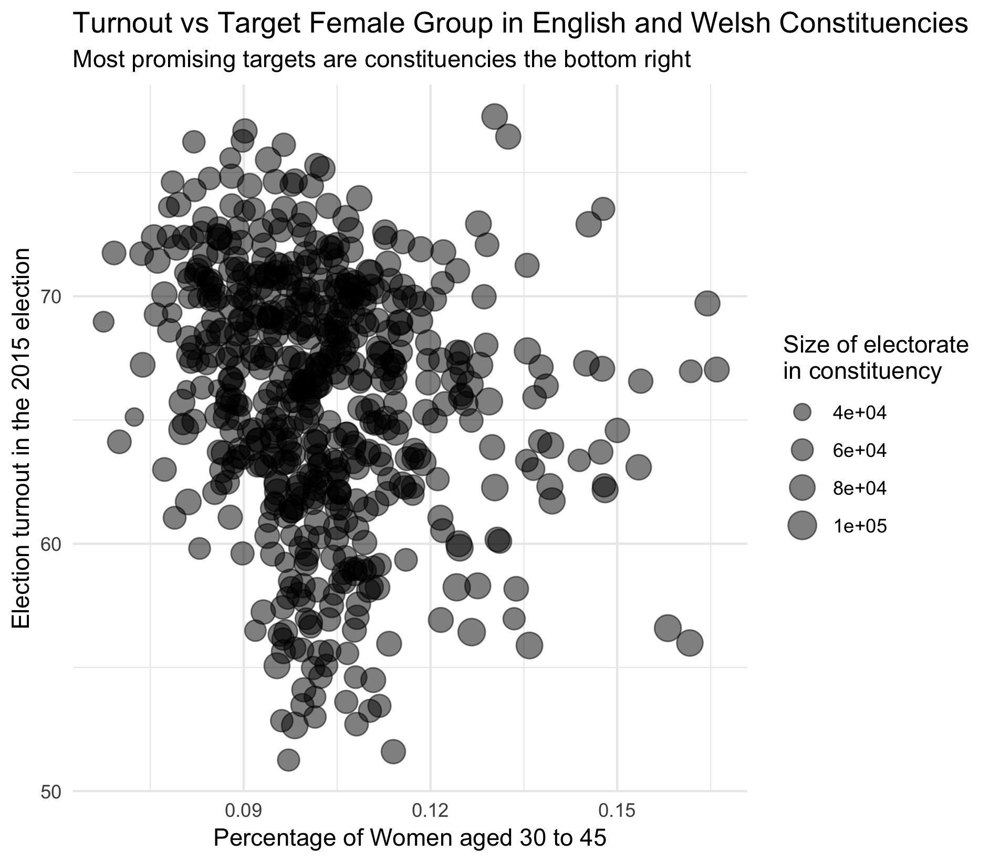

# targeted-demographics to increase voter engagement in EU 2019 vote

We came together at a hackathon to use data to improve voter engagement for the 2019 EU election. 

This scatterplot is a first result. It shows (for most of the 650 Constituencies) the proportion of 'voter engagement' (see below) vs women in a target demographic, each point is sized by the enrolled voter population in that Constituency:

'Voter engagement' is calculated by taking the percentage of people who voted in the 2015 General Election (a 'normal' election, unlike the 2017 rushed GE) and the enrolled population size who are eligible to vote in that Constituency. Some Constituencies have a much lower turn-out than others (range circa 52-78%, most are in the range 60-75%).

__Note__ that this is a proxy for engagement and it is likely to be noisy. It was noted by colleagues (hat tip Sym) in the DemocracyClub slack that using 1 GE will be noisy and we'd do better to calculate engagement by averaging results over several elections, this could be a __future project__.

* Project source: https://github.com/dxe4/demographics
* Slack: #targeted-demographics

## Data sources and key files (in `/data`)

**TODO** Can everyone please add some notes about the files they added (including - original location, a sentence or two about the data (e.g. year, intention, any issues or thoughts you have), whether this was an input file to a process or an output file from some of our code) please.

### EU-referendum-result-data.csv

### ages.csv

### ages2.csv

### areas_lat_lon.csv

### constituency_turnout.csv

### density.csv

### ethnic_groups.csv

### health.csv

### postcode_sector_lookup.csv

### r21ukrttableks102ukladv1_tcm77-330434 - r21ukrttableks102ukladv1_tcm77-330479.xls

### sex.csv

### ward-codes-w-30-45.csv

### ward_pop_f30to45.csv

### ward_to_local_district.csv

### GB_wards

Note folder has a small readme by Laurens (?)

### GB_wards_2017

### tidy_data.feather

## How to run the code

**TODO** can anyone who wrote code please note the high-level process. The goal would be to let one of us (or a likeminded soul) follow the flow of code and data in e.g. 6 months time - so add enough detail to assume that we've forgotten everything and need some nudges in the right direction please.

## Contributors

* AlexG
* Emiliano Cancellieri
* harry
* Ian Ozsvald, @ianozsvald, https://www.linkedin.com/in/ianozsvald
* jdleesmiller
* Laurens
* Pranay
* Nafiz Huq / Nick

