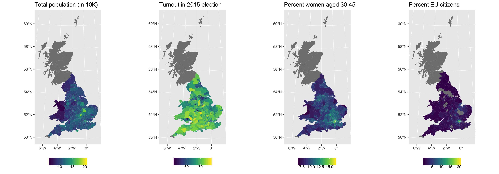

# Targeted-demographics to increase turnout in the 2019 EU election
We came together at a hackathon to use data to improve voter engagement for the 2019 EU election. We gathered data from a number of disparate sources and aggregated it to allow for better prioritisation of efforts for voter mobilisation. Data came at different spatial resolutions, from postcode sectors over wards to constituencies. The map below shows some of the variables we obtained at the constituency level:



The scatterplot below shows (for most of the 650 Constituencies) the proportion of 'voter engagement' vs women in a target demographic, each point is sized by the enrolled voter population in that Constituency. 'Voter engagement' is calculated by taking the percentage of people who voted in the 2015 General Election (a 'normal' election, unlike the 2017 rushed GE) and the enrolled population size who are eligible to vote in that Constituency. Some Constituencies have a much lower turn-out than others (range circa 52-78%, most are in the range 60-75%).


_Note_ that this is a proxy for engagement and it is likely to be noisy. It was noted by colleagues (hat tip Sym) in the DemocracyClub slack that using 1 GE will be noisy and we'd do better to calculate engagement by averaging results over several elections, this could be a _future project_.

ADD NOTES ON WHAT THIS GIVES US AND WHAT ELSE WE MIGHT DO (using Ian's local non-committed text file)

* Project source: https://github.com/dxe4/demographics
* Slack: #targeted-demographics

## Data sources and key files (in `/data`)
**TODO** Can everyone please add some notes about the files they added (including - original location, a sentence or two about the data (e.g. year, intention, any issues or thoughts you have), whether this was an input file to a process or an output file from some of our code) please.

### EU-referendum-result-data.csv

### ages.csv

### ages2.csv

### areas_lat_lon.csv

### constituency_turnout.csv
Data showing the turnout and electorate size for all 650 UK constituencies at the 2015 general election (the same info for the 2017 general election was not available so this was considered a good proxy). The data was scraped from http://www.ukpolitical.info/Turnout15.htm. Note slight changes to names of two constituencies so that they can be joined to `postcode_sector_lookup.csv`.

### density.csv

### ethnic_groups.csv

### health.csv

### postcode_sector_lookup.csv
List of all postcode sectors in the UK (based on the National Statistics Postcode Lookup (NSPL) table for the UK). Further details are in `postcode_sector_lookup_creation.ipynb`.

### r21ukrttableks102ukladv1_tcm77-330434 - r21ukrttableks102ukladv1_tcm77-330479.xls

### sectors_by_constituency.csv
For each constituency a list of all postcode sectors in that constituency.

### sex.csv
Count of M/F and population size per Ward. 521 rows.

### ward-codes-w-30-45.csv
DUPLICATE of ward_pop_f30to45.csv (and used in Notebooks) - SHOULD BE DELETED?

### ward_pop_f30to45.csv
Per Ward counts of electorate (nbr people eligible to vote) and percentage of those who voted in 2015 General Election. 8297 rows.

## Data at the postalcode sector granularity level

### postcode_sector_level_data.csv

Generated on the Sunday using data from census 2011:

```
postcode_sectors,code_constituency,turnout,women_age30to45,perc_eu,10to14%,15%,16to17%,18to19%,20to24%,25to29%,30to44%
GU12 4,E14000530,63.77,0.1174158,2.9,6,1.4,3,2.6,6.9,7.6,24.9
```

The data were collected on Sunday 28th April 2019 from the census of England and Wales of 2011 (http://www.nomisweb.co.uk/query/select/getdatasetbytheme.asp?collapse=yes). The uploaded files are "in" for the original files downloaded from the website and "out" for the one used to build the final cleaned table tidy_data.feather.

The downloaded data are for the following cathegories: EU born individuals resident in UK (`EUps_sector_in.csv`,`EUps_sector_out.csv`), EU passport owners resident in UK (`PASSPORTps_sector_in.csv`,`PASSPORTps_sector_out.csv`), women 30-45 (`WOMEN30_45ps_sector_in.csv`,`MENps_sector_in.csv`,`WOMEN30_45ps_sector_out.csv`), young people aged 10 in 2011 that can now vote (`AGESps_sector_in.csv`,`AGESps_sector_out.csv`)


### ward_to_local_district.csv

### GB_wards_2017
Geospatial and tabular data, as well as a lookup table to match wards to constituencies. Downloaded from the Office for National Statistics:
* http://geoportal.statistics.gov.uk/datasets/wards-december-2017-generalised-clipped-boundaries-in-great-britain
* http://geoportal.statistics.gov.uk/datasets/ward-to-westminster-parliamentary-constituency-to-local-authority-district-december-2017-lookup-in-the-united-kingdom


### tidy_data.feather
Master data frame with combined information from disparate sources. This was generated from individual csvs and shapefiles by running `01_etl.R`

## How to run the code
**TODO** can anyone who wrote code please note the high-level process. The goal would be to let one of us (or a likeminded soul) follow the flow of code and data in e.g. 6 months time - so add enough detail to assume that we've forgotten everything and need some nudges in the right direction please.

`01_etl.R` reads data from different sources and produces a dataset at constituency level in `feather` format (`data/constituency_data.feather`). This data is then used in `02_plots.R` to generate visualisations and `03_experiment_selection.R` to choose a number of postcodes that we conducted geo-experients for. If you are interested in postcode-level data you can also use `data/postcode_sector_data.feather`. However, be aware that some data that wasn't available at postcode sector level was assumed constant for all postcode sectors in a single constituency.

`titled.ipynb` and `Untitled.ipynb` appear to do some work on the health data (via Harry perhaps?) and these Notebooks produce no output.


### First micro result

Result of test by Pranay overnight on a small ad sample

```
Audience    Unique Reach    Click-through Rate
Control Group 	3354    	14.71%
Kensington  	64 		0
Barking    	51 		0
Slough    	204 		50%
Hackney North  	439  		22.22%
Hackney South 	558  		7.69%
```

This is documented in: 04_eval.R

## Note from Mel on "who we might target"

```
EU Election targeting breakdown:·       Students;
·       Women (esp 30-45)
·       The under 45s;
·       Non-British EU nationals living in the UK (note that for the EP elections, they need to complete an additional form AND return it to their electoral office 12 working days before the election (ie. 7th May)
·       Non-British EU nationals (and their families) living in the UK
·       Commonwealth citizens - these can be further split into regions, eg Asia, ANZ, Caribbean etc
·       BAME voters
```

## Contributors
* AlexG
* Emiliano Cancellieri, https://www.linkedin.com/in/emilianocancellieri/
* harry
* Ian Ozsvald, @ianozsvald, https://www.linkedin.com/in/ianozsvald
* jdleesmiller
* Laurens Geffert, @JanLauGe, https://www.linkedin.com/in/laurensgeffert/
* Pranay
* Nick Rhodes, https://www.linkedin.com/in/nickorhodes

## Thanks to
* jonathanf (DemocracyClub)
* sym (DemocracyClub)


## Future
* We could try averaging voter turnout by Constituency for several elections
* We could try getting the public electoral role for the Open Register, it should be a good proxy for voter enrollment despite people opting out (hatip chris48s in DemocracyClub)
* Sym noted that http://manchester.academia.edu/RobertFord might have open ward-level data
* Another source of data: the [British Election Study](https://www.britishelectionstudy.com/) wave 14 from May 2018. We also wrote some code to target at Local Authority District or NUTS2 level using these data: https://github.com/TechForUK/british_election_study
* http://takepart.london/ was written in part by Sym, he notes that it has 500 Int Server errors and that these won't be fixed, it was built with non-public electoral role data
* We could get the postcodes for the Revoke Article 50 petition and use these as another source of 'where to get support' if voter turnout was low
  * https://www.livefrombrexit.com/petitions/241584
* https://www.electoralcalculus.co.uk/homepage.html has projections of Ward level (not Constituency level) voter intentions, we could use this (but have to scrape it) for better targeting
  * note Laurens found: https://www.electoralcalculus.co.uk/flatfile.html
* A linear model could be built to let us rank the projected 650 Constituencies by 'preference' for whatever metric we like
* Harry used http://convertjson.com/html-table-to-json.htm to convert an HTML table to JSON giving https://gist.github.com/dxe4/ebef97bf22ca3bcad220b73a37dc37e9 for turnouts from  http://www.ukpolitical.info/Turnout45.htm
* https://opendata.camden.gov.uk/Maps/National-Statistics-Postcode-Lookup-UK/tr8t-gqz7
* http://geoportal.statistics.gov.uk/datasets/ward-to-westminster-parliamentary-constituency-to-local-authority-district-december-2016-lookup-in-the-united-kingdom/data
* https://github.com/TechForUK/british_election_study
* https://github.com/google/GeoexperimentsResearch
* https://github.com/jazzmuesli/eupetitions
* https://en.wikipedia.org/wiki/D'Hondt_method

## Thoughts

* Averaging voter turnout for several elections is more likely to show us the 'truth' that just the GE 2015
  * We used Turnout15, we also have 2010, 2005, 2001, 1997 via http://www.ukpolitical.info/Turnout45.htm
  * Use convertjson (above) to trivially turn these tables into JSON!
* Slicing the data in different ways gives us ways to run many experiments
  * https://democracyclub.org.uk/reports/whos_missing/
